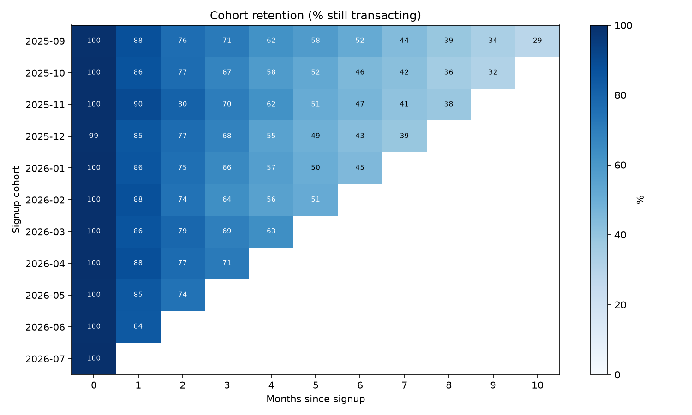

# Fintech Product Analytics

A small end-to-end product analytics pipeline, built to learn how the job is
actually done: raw event logs in, SQL in the middle, decisions out.

The data is **simulated**. No fintech publishes sign-up and transaction logs,
so `src/generate_data.py` creates 20,000 users with a realistic funnel, a
retention curve that decays, and an embedded A/B test. Every effect in the
data is planted deliberately and documented in that file, which means each
analysis can be checked against a known answer. That turned out to be the
most useful part of the project.



## Pipeline

1. **ETL** (`src/etl.py`, `sql/user_funnel.sql`): three raw CSVs (users,
   events, transactions) loaded into DuckDB; a one-row-per-user funnel table
   derived from the event log with SQL.
2. **Funnel** (`sql/funnel_by_channel.sql`): step-by-step conversion,
   overall and by acquisition channel.
3. **Retention** (`sql/cohort_retention.sql`): monthly cohort retention,
   with months counted from each user's signup date.
4. **A/B test** (`src/ab_test.py`): a £10 first-deposit bonus, tested for
   both statistical lift and profitability.

`python main.py` runs everything.

## Findings

**Where the funnel leaks depends on the channel.** Referral users convert 39%
end to end, paid social 27%. But the leaks are in different places: paid
social loses users at KYC (62% vs ~68%), referral gains them at first deposit
(66% vs ~53%). Same headline, different fix.

**Half of active users are gone in six months.** Month-1 retention is 86%,
month-6 is 46%, month-9 is 33%. The simulator's monthly churn hazard is 12%,
which implies 0.88⁶ ≈ 46% at six months, so the pipeline recovers the planted
parameter.

**The bonus worked and lost money.** Conversion rose from 35.1% to 41.5%
(+6.4 points, 95% CI +3.1 to +9.6, p = 0.0001). But the bonus is paid to every
converting user, not just the extra ones, so it cost about £65 per
*incremental* depositor against pennies of 90-day revenue at a 1% take rate.
Payback: ~45 months. "Significant" and "profitable" are different questions.


## Run

```
pip install -r requirements.txt
python main.py
```

Regenerates the data, builds `data/analytics.duckdb`, and writes charts to
`results/`. Takes about two minutes.